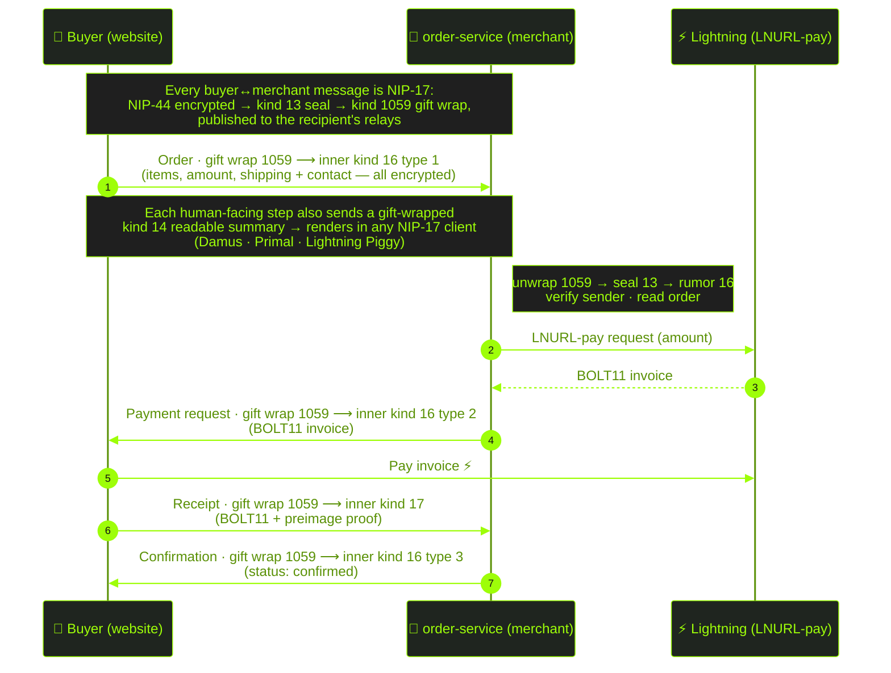

# Robotechy Website

A Nostr-native e-commerce website built with React, using Gamma Markets spec for products and orders, with Lightning Network payments.

## Quick Start

```bash
# Install dependencies and start development server
npm run dev

# Run both frontend and order service together
npm run dev:all

# Run order service separately
npm run dev:orders
```

## Order Processing

The checkout system uses the **Gamma Markets specification** (Kind 16/17 events) for orders and payments, transported end-to-end over **NIP-17 gift wraps**. Every buyer ↔ merchant message — order, payment request, receipt, status — is NIP-44 encrypted, sealed in a kind 13 event, wrapped in a kind 1059 gift wrap, and published to the recipient's relays. Customer PII (name, address, email, phone) rides **inside** the encrypted wrap and never appears in a plaintext public event.

### Dual channel: structured + readable (both encrypted)

Each human-facing step is sent twice, and **both copies are NIP-17 gift-wrapped (encrypted)**:

- **Structured** — the authoritative Gamma Markets inner rumor (kind 16 type 1/2/3/4, or kind 17). The order-service and rich clients (e.g. Lightning Piggy) parse this for structured order cards.
- **Readable** — an informational inner **kind 14** plain-text summary so the same order/receipt/status also renders in any generic NIP-17 client (Damus, Primal).

This is **not** the old leaky dual-send: the previous flow paired a plaintext kind 16 with an unencrypted NIP-04 DM. Now there is no plaintext event and no NIP-04 — both the structured and readable copies are encrypted gift wraps.

### Order Flow



The **order-service** subscribes to kind 1059 gift wraps addressed to the merchant, unwraps each to its inner rumor (authenticating the sender), dispatches orders (kind 16 type 1) and receipts (kind 17), and replies with gift wraps. It no longer reads plaintext kind 16/17 events or sends NIP-04 DMs.

### Event Types

All commerce events below are carried **inside** a NIP-17 gift wrap (kind 1059) as the inner rumor — never published as plaintext.

| Inner kind | Type | Description |
|------|------|-------------|
| 16 | 1 | Order creation (buyer → merchant) |
| 16 | 2 | Payment request with invoice (merchant → buyer) |
| 16 | 3 | Order status update |
| 16 | 4 | Shipping update |
| 17 | - | Payment receipt with preimage |
| 14 | - | Readable plain-text summary (renders in any NIP-17 client) |
| 1059 | - | Gift wrap transport (NIP-17/NIP-59) for all of the above |

### Payment Options

The checkout UI supports multiple payment methods:
- **QR Code** - Scan with any Lightning wallet
- **Copy Invoice** - Paste into wallet apps
- **WebLN** - Browser extensions (Alby, etc.)
- **NWC** - Nostr Wallet Connect
- **Open in Wallet** - `lightning:` URI link

## Order Service Setup

The order processing service runs as a Node.js backend:

```bash
cd order-service
cp .env.example .env
# Edit .env with your merchant nsec and Lightning Address
npm install
npm start
```

### Environment Variables

```bash
MERCHANT_NSEC=nsec1...           # Merchant's secret key
LIGHTNING_ADDRESS=you@getalby.com # Lightning Address for invoices
FALLBACK_RELAYS=wss://relay.damus.io,wss://nos.lol
```

## Development

```bash
npm run dev          # Frontend only
npm run dev:orders   # Order service only
npm run dev:all      # Both together
npm run test         # Run all tests
npm run build        # Production build
npm run deploy       # Deploy to Nostr
```

## Docker

Build and run as a single container with both frontend and order service:

```bash
# Build the image
docker build -t robotechy:latest .

# Run with order service enabled
docker run -d \
  -p 3000:3000 \
  -e MERCHANT_NSEC=nsec1... \
  -e LIGHTNING_ADDRESS=yourname@getalby.com \
  -e FALLBACK_RELAYS=wss://relay.damus.io,wss://nos.lol,wss://relay.primal.net \
  --name robotechy \
  robotechy:latest

# Run frontend only (no order processing)
docker run -d -p 3000:3000 --name robotechy robotechy:latest
```

The frontend is served on port 3000. The order service connects outbound to Nostr relays (no inbound port needed).

### Environment Variables

| Variable | Required | Description |
|----------|----------|-------------|
| `MERCHANT_NSEC` | For orders | Merchant's Nostr secret key (nsec format) |
| `LIGHTNING_ADDRESS` | For orders | Lightning Address for invoice generation |
| `FALLBACK_RELAYS` | No | Comma-separated relay URLs (has defaults) |

If `MERCHANT_NSEC` or `LIGHTNING_ADDRESS` are not set, the container runs frontend-only mode.

## Technology Stack

- **Frontend**: React 18, TypeScript, Vite, TailwindCSS, shadcn/ui
- **Nostr**: Nostrify, nostr-tools
- **Orders**: Gamma Markets spec (Kind 16/17), NIP-17 gift-wrapped end-to-end
- **Payments**: Lightning Network via LNURL-pay
- **Messaging**: NIP-17 gift wraps (NIP-44 encryption, kind 13 seal, kind 1059 wrap)
- **Container**: Docker with Node.js 20 Alpine
